# SmartShell Deno - Architecture Diagrams

## Overall System Architecture

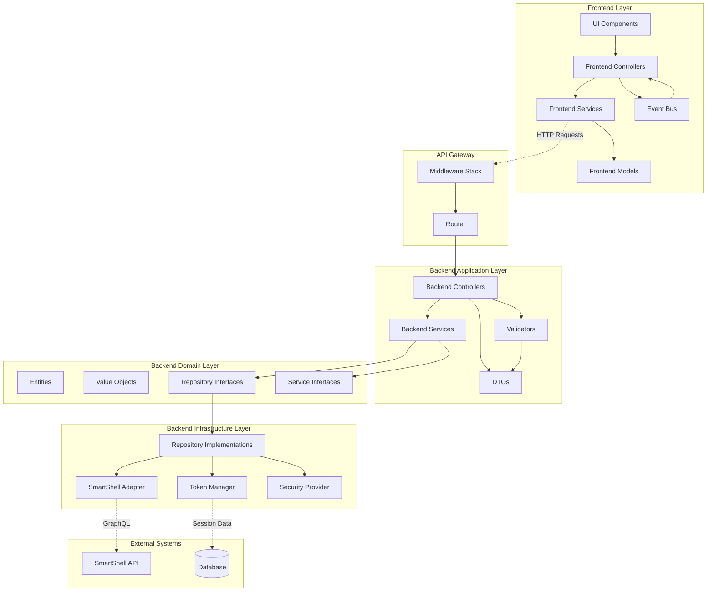

## Backend MVC Architecture

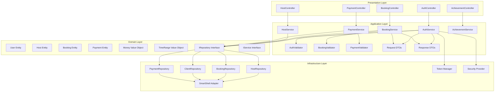

## Frontend MVC Architecture

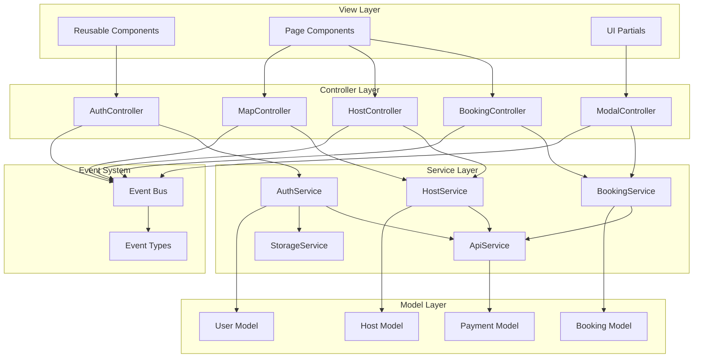

## Dependency Injection Flow

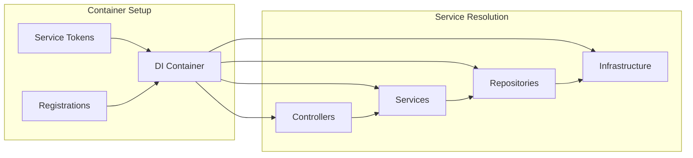

## Request Flow Diagram

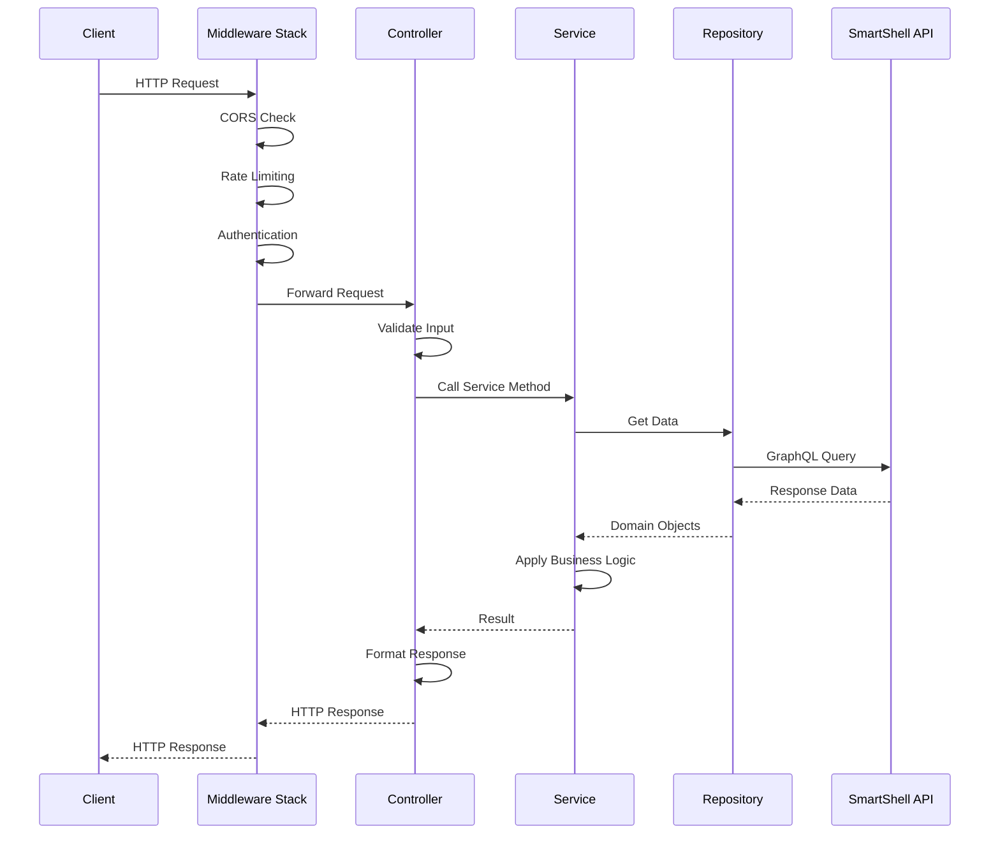

## Frontend Component Interaction

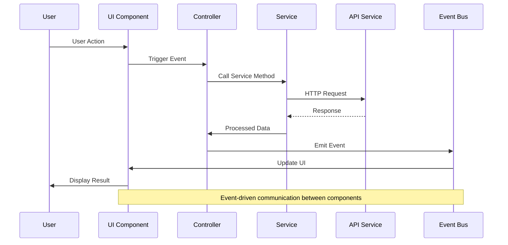

## Data Flow Architecture

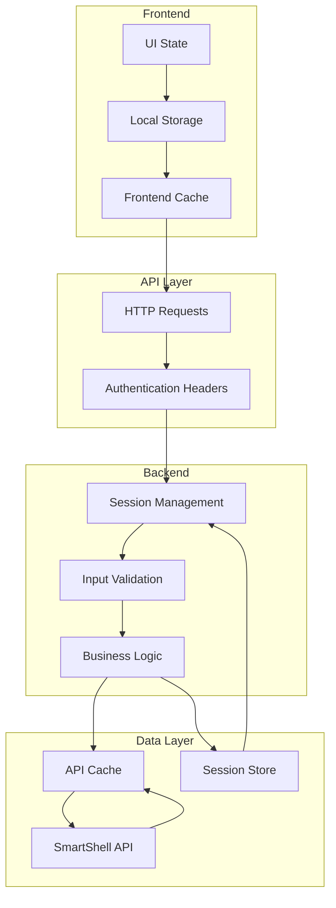

## Security Architecture

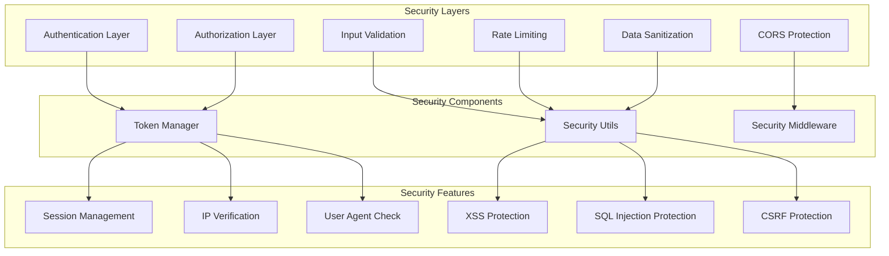

## Error Handling Flow

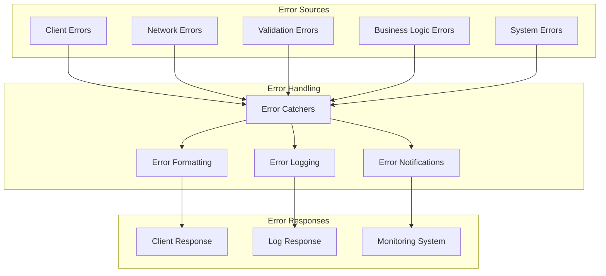

## Testing Architecture

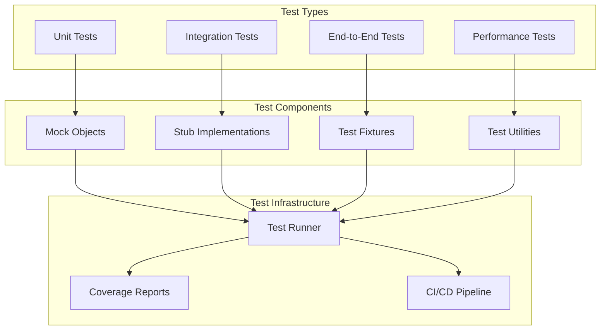

## Deployment Architecture

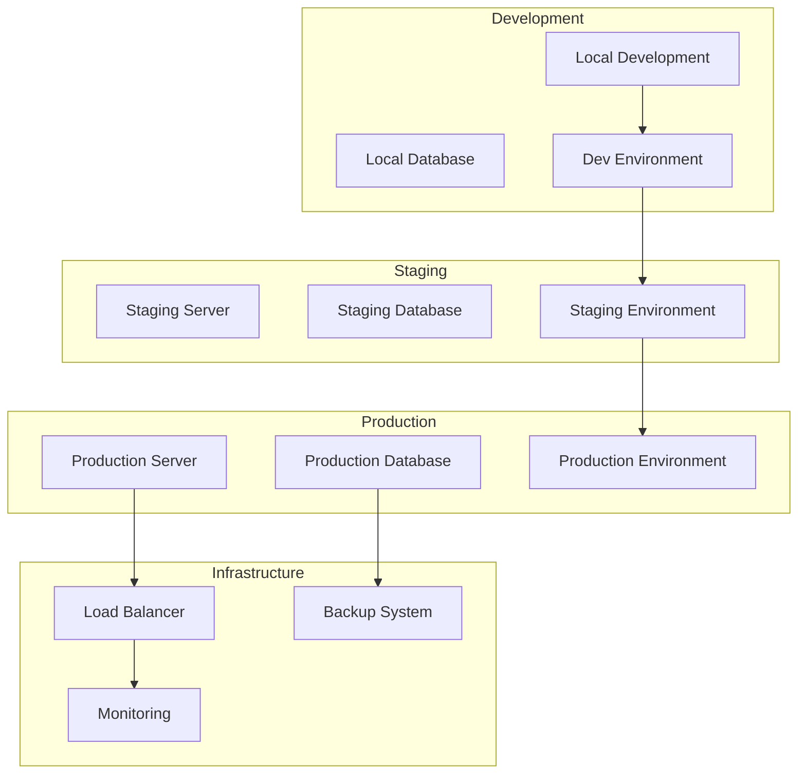

## Migration Strategy

```mermaid
graph LR
    subgraph "Phase 1: Foundation"
        DI[Dependency Injection]
        INTERFACES[Domain Interfaces]
        BASE[Base Classes]
    end

    subgraph "Phase 2: Backend"
        REPOS[Repositories]
        SERVICES[Services]
        CONTROLLERS[Controllers]
    end

    subgraph "Phase 3: Frontend"
        COMPONENTS[UI Components]
        SERVICES_F[Frontend Services]
        CONTROLLERS_F[Frontend Controllers]
    end

    subgraph "Phase 4: Integration"
        TESTING[Comprehensive Testing]
        MIGRATION[Data Migration]
        MONITORING[Monitoring Setup]
    end

    DI --> REPOS
    INTERFACES --> SERVICES
    BASE --> CONTROLLERS

    REPOS --> COMPONENTS
    SERVICES --> SERVICES_F
    CONTROLLERS --> CONTROLLERS_F

    COMPONENTS --> TESTING
    SERVICES_F --> MIGRATION
    CONTROLLERS_F --> MONITORING